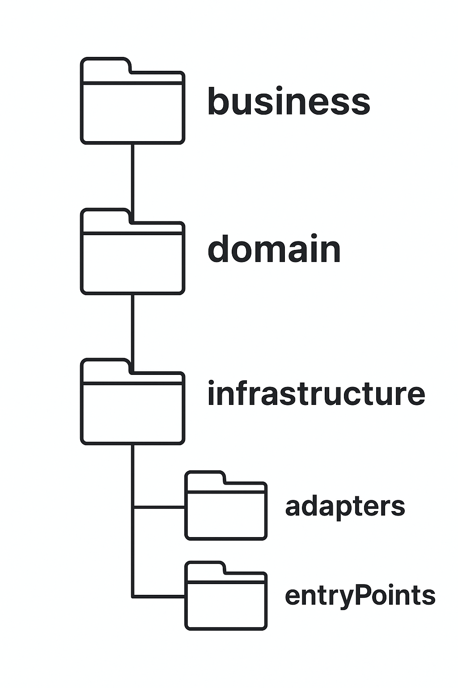
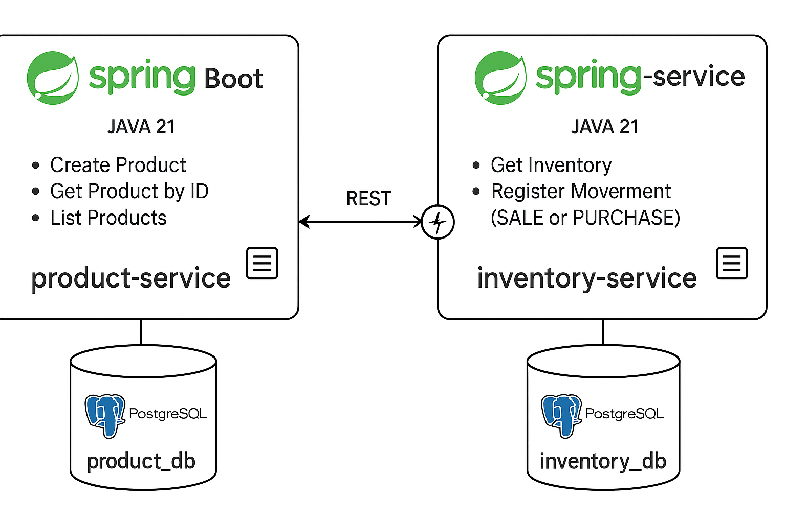

# 📦 Sistema de Gestión de Inventario

Sistema de gestión de inventario basado en **microservicios**, desarrollado en **Java 21** con **Spring Boot 3.5.3**.  
Permite registrar productos, consultar su inventario y registrar movimientos de stock

<br> <!-- Salto de línea -->
## Contenido


- [Funcionalidades Principales](#-funcionalidades-principales)
- [Tecnologías Utilizadas](#%EF%B8%8F-tecnologías-utilizadas)
- [Instalación y ejecución](#-instalación-y-ejecución)
- [Descripción de la arquitectura y patrones de diseño](#%EF%B8%8F-descripción-de-la-arquitectura-y-patrones)
- [Diagrama de interacción entre servicios](#-diagrama-de-interacción-entre-servicios)
- [Decisiones técnicas y justificaciones](#%EF%B8%8F-decisiones-técnicas-y-justificaciones)
- [Explicación del flujo de compra implementado](#-explicación-del-flujo-de-compra-implementado)
- [Endpoints](#-endpoints)
- [Documentación de endpoints](#-documentación-de-endpoints)
- [Manejo de Excepciones](#-manejo-de-excepciones)
- [Pruebas](#-pruebas)
- [Documentación sobre el uso de herramientas de IA](#-documentación-sobre-el-uso-de-herramientas-de-ia)


<br> <!-- Salto de línea -->
## 🧩 Funcionalidades Principales

- Crear producto, consultar por ID y obtener lista de productos
- Consultar stock de producto y obtener su informacion desde el otro microservicio
- Actualizar cantidad disponible de producto
- Endpoint de movimientos (para integrar flujo de compras o transacciones)
- Comunicacion sincronica entre microservicios mediante HTTP
- Arquitectura limpia y patrones de diseño
- Se implementa transaccion para mantener la consistencia de datos entre ambos servicios (atomicidad)
- Manejo de exepciones, se implementan personalizadas y se crean un manejador global de excepciones
- Respuestas del API cumpliendo los estandares de JSON:API
- Autenticacion basica mediante API keys
- Manejo de timeouts y reintentos basicos con circuit braker
  


<br> <!-- Salto de línea -->
## 🛠️ Tecnologías Utilizadas
- Java 21
- Spring Boot 3.5.3
- Spring WebFlux (WebClient)
- PostgreSQL
- Resilience4j (Circuit Breaker)
- Docker & Docker Compose
- Maven


<br> <!-- Salto de línea -->
## 📦 Instalación y ejecución

1. Clona el repositorio:
```bash
git clone https://github.com/Vex-Alexis/devsu-sistema-bancario.git
```
2. Navega al directorio del proyecto:
```bash
cd devsu-sistema-bancario
```
3. Levanta los servicios:
```bash
docker-compose up -d
```
4. Servicios expuestos:

| Servicio                | Puerto
|-------------------------|------
| product-service         | `8080`
| inventory-service       | `8081`
| product-db              | `5433`
| inventory-db            | `5434`

> Asegúrate de que no estén siendo usados por otros procesos.


<br> <!-- Salto de línea -->
## 🏛️ Descripción de la arquitectura y patrones

El proyecto está implementado una **Arquitectura limpia** con el patrón **Ports & Adapters (arquitectura hexagonal)** y aplicando principios de **DDD (Domain-Driven Design)** para una mejor separación de responsabilidades y mantenibilidad. Cada capa tiene su responsabilidad: 

<p align="center">
  
</p>

 #### - Domain
Contiene los modelos y entidades de dominio, que representan las reglas y la lógica de negocio También define los puertos como interfaces ("Gateways") que se utilizarán en la capa de negocio.
 #### - Business
Define la lógica de la aplicación y reacciona a las invocaciones de los `entry-poits`, orquestando los flujos y utilizando los puertos definidos.
 #### - Infraestructure
En esta capa, se detallarán las tecnologías e implementaciones de los puertos definidos en la capa de dominio. Esta capa está compuesta por dos grupos de módulos llamados `entry-points` y `driven-adapters`.
  - `driven-adapters` son los módulos implementan las interfaces ("Gateways") para conectar tecnologías externas al sistema, como conexiones a bases de datos, servicios REST, SOAP, lectura de archivos planos y, en particular, cualquier fuente de datos con la que debamos interactuar.
  - `entry-poits` son los puntos de entrada de la aplicación o el inicio de los flujos de negocio. Estos pueden ser controladores REST, consumidores de Kafka, SQS, etc, además de manejo centralizado de excepciones.

## ✏️ patrones de diseño

- **Dependency Injection:** facilita la inversión de dependencias y el desac acoplamiento de componentes.
- **Repository Pattern:** abstrae el acceso a la persistencia, ocultando detalles del almacenamiento.
- **Adapter Pattern:** permite integrar tecnologías o servicios externos sin acoplar el dominio.
- **Service Layer:** encapsula la lógica de negocio de la aplicación.
- **Transactional:** asegura la integridad de los datos durante operaciones críticas.
- **DTO & Mapper:** se usan para transferir datos entre capas y evitar exponer directamente las entidades de dominio.
- **Resilience Patterns:** implementación de reintentos, timeouts u otros mecanismos para mayor tolerancia a fallos.
- **Exception Handler:** manejo centralizado de errores para devolver respuestas consistentes.


<br> <!-- Salto de línea -->
## 🔄 Diagrama de interacción entre servicios


<p align="center">
  
</p>


El sistema implementa una arquitectura de microservicios donde cada servicio tiene su propia base de datos (Database per Service) y se comunica de la siguiente forma:

- Comunicación síncrona:
`inventory-service` consume el API REST de `product-service` mediante WebClient, para obtener la información del producto.
Para garantizar resiliencia se implementa un circuit breaker que maneja reintentos, fallback y timeout, evitando que fallas en `product-service` afecten a `inventory-service`.

- Comunicación asíncrona (Planeado, no implementado):
La idea era que `product-service` publicara un evento a AWS SQS al crear un nuevo producto, y `inventory-service` consumiera ese evento para crear automáticamente el inventario correspondiente.
Esto permitiría desacoplar los servicios y procesar eventos de forma eventual.


<br> <!-- Salto de línea -->
## ⚙️ Decisiones técnicas y justificaciones

- **Base de datos (PostgreSQL por microservicio):** Se eligió PostgreSQL por ser una base de datos relacional, con soporte para integridad referencial y transacciones. Además, cada microservicio tiene su propia base de datos (Database per Service) para garantizar un mayor desacoplamiento, escalabilidad y evitar dependencias directas a nivel de datos entre servicios.
- **Comunicación síncrona usando WebClient:** Se optó por una llamada HTTP REST síncrona entre `inventory-service` y `product-service` para resolver solicitudes en tiempo real (en este caso, consultar información actualizada del producto). Se eligió WebClient por su naturaleza reactiva, ligera y no bloqueante, mejorando el rendimiento y escalabilidad
- **Registros atómicos y manejo transaccional:** Al registrar un movimiento de inventario (compra o venta) y actualizar el stock, se configuró la operación como transaccional. Esto asegura que las operaciones se realicen de forma atómica, manteniendo la consistencia de los datos incluso ante fallos parciales

- **Manejador global de excepciones:** Se creó un handler global que captura errores controlados y lanza respuestas claras al cliente. Sse definieron excepciones personalizadas que son lanzadas desde la lógica de negocio ante casos esperados (como no existencia de un producto, datos inválidos, etc.), permitiendo separar la gestión de errores de la lógica principal.

- **Circuit breaker (Resilience4j):** Se implementó un circuit breaker usando Resilience4j para proteger el `inventory-service` de fallas o latencias excesivas al consumir el `product-service`. Este patrón gestiona reintentos, fallback y timeout, evitando fallos en cascada y mejorando la resiliencia general del sistema.


<br> <!-- Salto de línea -->
## 🛒 Explicación del flujo de compra implementado

### Decisión de diseño
En lugar de crear un endpoint llamado explícitamente /purchase, decidí implementar un flujo de movimientos (SALE o PURCHASE) en el microservicio inventory-service.
Esto se traduce en un endpoint REST:
```http
POST /inventory/products/{productId}/movements
```
> donde el cuerpo indica el tipo de movimiento (SALE o PURCHASE) y la cantidad.

###  Justificación
**Separación de responsabilidades y bajo acoplamiento**
- Un flujo de compra completo suele pertenecer a un dominio distinto, típicamente gestionado por un microservicio de ordenes o compras (order-service o purchase-service).
- Mantener la lógica del proceso completo de compra dentro del inventory-service violaría el principio de responsabilidad única (SRP), mezclando la gestión de inventario con la gestión de pedidos.

### ⚙️ Flujo implementado
1. Recibe en la URL el productId y en el cuerpo: cantidad + tipo de movimiento.
2. Valida: la cantidad debe ser > 0 y el tipo de movimiento debe estar definido.
3. Consulta inventario por productId:
    - Si no existe → lanza excepción.
4. Actualiza stock:
    - Si es SALE: descuenta stock solo si hay suficiente.
    - Si es PURCHASE: suma al stock.
5. Guarda el movimiento en la base de datos.
6. Retorna respuesta enriquecida con datos del producto, tipo de movimiento, cantidad y stock actualizado.

### 🧪 Consistencia y manejo de errores
- Se usa una transacción (@Transactional) para asegurar que tanto la actualización del inventario como el registro del movimiento se realicen de forma atómica.
- Se lanzan errores claros si:
    - El producto no existe.
    - La cantidad es inválida.
    - No hay stock suficiente para la venta.

### ✅ Ventajas de este diseño
- **Bajo acoplamiento:** el servicio de inventario solo gestiona inventario, no lógica de negocio de compras/órdenes.
- **Escalable:** un futuro order-service puede coordinar con el inventory-service para registrar movimientos de stock, sin duplicar lógica.
- **Simple y claro:** cumple con el requerimiento de actualizar y verificar stock.
- **Extensible:** permite otros tipos de movimientos como ajustes o devoluciones.


<br> <!-- Salto de línea -->
## 📡 Endpoints

Puedes usar la colección de Postman para probar rápidamente todos los endpoints disponibles.

Ruta dentro del repositorio:
postman_collection.json -> [📄 Postman Collection](./postman_collection.json)

<br> <!-- Salto de línea -->
### 📦 Product Service (`/clientes`)

| Método | Endpoint                                     | Descripción                             |
|--------|----------------------------------------------|-----------------------------------------|
| POST   | `/products`                                  | Crear un nuevo producto                 |
| GET    | `/products/{productId}`                      | Obtener detalle de un producto          |
| GET    | `/products`                                  | Listar todos los productos              |

<br> <!-- Salto de línea -->
### 🏪 Inventory Service 

| Método | Endpoint                                     | Descripción                             |
|--------|----------------------------------------------|-----------------------------------------|
| GET    | `/inventory/{productId}`                     | Obtener inventario de un producto                     |
| PUT    | `/inventory/{productId}`                     | Actualizar cantidad disponible de inventario          |
| POST   | `/inventory/products/{productId}/movements`  | Registrar un movimiento (SALE, PURCHASE, ADJUSTMENT)       |


<br> <!-- Salto de línea -->
## 📄 Documentación de endpoints

<br> <!-- Salto de línea -->
## 🚨 Manejo de Excepciones

<br> <!-- Salto de línea -->
## 🧪 Pruebas implementadas
Este proyecto implementa pruebas unitarias y de integración para asegurar el correcto funcionamiento de los microservicios.

<br> <!-- Salto de línea -->
### 📦 Product Service

- ✅ Pruebas Unitarias
    - Crear un producto.
    - Consultar producto por ID (exitoso y no encontrado).
    -  Consultar todos los productos.

- 🔗 Pruebas de integración
    - Crear un producto y consultarlo por ID.
    - Consultar todos los productos existentes.
    - Validar error cuando se consulta un producto inexistente.

<br> <!-- Salto de línea -->
### 🏪 Inventory Service

✅ Pruebas unitarias
- Consultar detalles de inventario (exitoso y no encontrado).
- Actualizar cantidad del inventario (exitoso y no encontrado).
- Registrar movimientos de inventario:
    - Venta (reduce stock).
    - Compra (aumenta stock).
    - Ajuste directo de stock.
- Validar reglas de negocio:
    - No permitir cantidad cero.
    - Tipo de movimiento obligatorio y soportado.
    - No permitir ventas si no hay suficiente stock.

🔗 Prueba de integración
- Registrar una venta y verificar que el inventario disminuye correctamente.

<br> <!-- Salto de línea -->
### ▶️ Cómo ejecutar las pruebas

Para ejecutar las pruebas unitarias/integración:
1. Clona el repositorio.
2. Si aun no has levantado los contenedores necesarios ejecuta:
```bash
docker compose up -d
```
3. Entra a la carpeta del microservicio que quieres probar.
4. Ejecuta las pruebas:
- En Windows
```bash
mvnw.cmd test
```
### 📌 Ejemplo de ejecución por microservicio

#### 📦 Product Service
```bash
cd product-service
```
```bash
mvnw.cmd test
```

#### 🏪 Inventory Service
```bash
cd inventory-service
```
```bash
mvnw.cmd test
```


<br> <!-- Salto de línea -->
## 🤖 Documentación sobre el uso de herramientas de IA

Durante el desarrollo de este proyecto se utilizaron herramientas de IA para apoyar principalmente en:
  - **Redacción de documentación:** se empleó ChatGPT para redactar descripciones técnicas, justificar decisiones de arquitectura y crear textos para el README.
  - **Asistencia en generación de código:** se consultaron sugerencias para patrones de diseño, manejo de excepciones y estructura de controladores y servicios.
  - **Optimización y revisión:** se usó IA para mejorar la claridad de nombres de clases, métodos y refactorizar fragmentos de código repetitivo.

**Verificación de calidad:**
Todo el código sugerido por IA fue revisado manualmente, adaptado a las necesidades del proyecto y probado localmente para asegurar que cumpliera con las reglas de negocio, principios de arquitectura y buenas prácticas establecidas.


